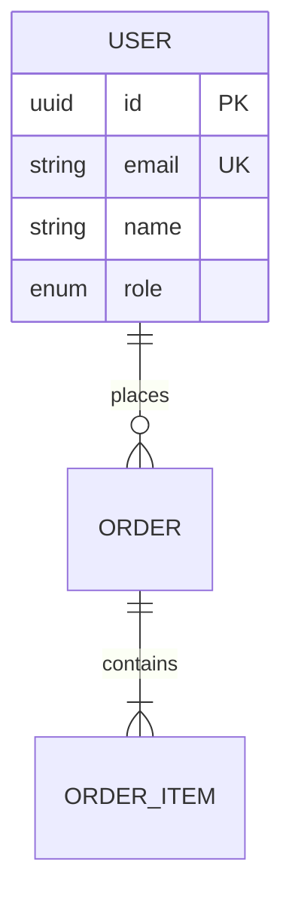

# /project:generate-tech-spec

## Mission

Generate a comprehensive Technical Specification document by analyzing the PRD, existing codebase, and architectural requirements. This document serves as the technical blueprint for implementation.

## Prerequisites

- PRD exists at `project-management/prd.md` or specified path
- Project directory with codebase (for existing projects)
- Technology stack identified

## Workflow

### Phase 1: PRD Analysis

```
╔══════════════════════════════════════════════════════════╗
║           TECH SPEC GENERATION - ANALYSIS                 ║
╠══════════════════════════════════════════════════════════╣
║ Loading PRD and analyzing requirements...                 ║
╚══════════════════════════════════════════════════════════╝
```

**Extract from PRD:**
- Functional requirements (features to build)
- Non-functional requirements (performance, security, scalability)
- Personas and user journeys
- Constraints and assumptions
- Integration requirements

### Phase 2: Codebase Analysis

If existing codebase:

```
╔══════════════════════════════════════════════════════════╗
║               CODEBASE ANALYSIS                           ║
╠══════════════════════════════════════════════════════════╣
║ Detected Stack:                                           ║
║ ├── Backend: Symfony 7.x (PHP 8.3)                        ║
║ ├── Frontend: React 18.x (TypeScript)                     ║
║ ├── Database: PostgreSQL 16                               ║
║ ├── Cache: Redis 7.x                                      ║
║ └── Infrastructure: Docker + Kubernetes                   ║
║                                                           ║
║ Existing Patterns:                                        ║
║ ├── Architecture: Clean Architecture (Hexagonal)          ║
║ ├── API Style: REST with JSON:API                         ║
║ ├── Auth: JWT with refresh tokens                         ║
║ └── Testing: PHPUnit + Jest + Playwright                  ║
╚══════════════════════════════════════════════════════════╝
```

For new projects, ask:

```
┌─────────────────────────────────────────────────────────┐
│ QUESTIONS - Technology Stack                             │
├─────────────────────────────────────────────────────────┤
│ 1. Preferred backend framework? (Symfony/Laravel/Node)   │
│ 2. Frontend framework? (React/Vue/Angular/None)          │
│ 3. Database preference? (PostgreSQL/MySQL/MongoDB)       │
│ 4. Deployment target? (Docker/K8s/Serverless/VPS)        │
│ 5. Any existing integrations to consider?                │
└─────────────────────────────────────────────────────────┘
```

### Phase 3: Architecture Design

**Ask clarifying questions:**

```
┌─────────────────────────────────────────────────────────┐
│ QUESTIONS - Architecture Decisions                       │
├─────────────────────────────────────────────────────────┤
│ 1. Monolith or Microservices?                            │
│ 2. API style preference? (REST/GraphQL/gRPC)             │
│ 3. Expected scale? (users, requests/sec)                 │
│ 4. Real-time features needed? (WebSockets/SSE)           │
│ 5. File storage requirements? (S3/local/CDN)             │
│ 6. Background job processing needs?                      │
│ 7. Third-party integrations? (payments, email, etc.)     │
└─────────────────────────────────────────────────────────┘
```

### Phase 4: Data Model Design

Based on PRD entities, design the data model:



**Validate with user:**
- Entity relationships correct?
- Missing entities?
- Indexing strategy appropriate?

### Phase 5: API Design

Generate API endpoints based on requirements:

```
╔══════════════════════════════════════════════════════════╗
║               PROPOSED API ENDPOINTS                      ║
╠══════════════════════════════════════════════════════════╣
║ Authentication:                                           ║
║   POST /api/v1/auth/login                                 ║
║   POST /api/v1/auth/register                              ║
║   POST /api/v1/auth/refresh                               ║
║                                                           ║
║ Users (from Persona: Admin):                              ║
║   GET    /api/v1/users                                    ║
║   GET    /api/v1/users/{id}                               ║
║   PUT    /api/v1/users/{id}                               ║
║   DELETE /api/v1/users/{id}                               ║
║                                                           ║
║ [Based on FR-001] Orders:                                 ║
║   GET    /api/v1/orders                                   ║
║   POST   /api/v1/orders                                   ║
║   GET    /api/v1/orders/{id}                              ║
╚══════════════════════════════════════════════════════════╝
```

### Phase 6: Security & Performance

**Security considerations based on NFRs:**

```
┌─────────────────────────────────────────────────────────┐
│ SECURITY CHECKLIST                                       │
├─────────────────────────────────────────────────────────┤
│ ✅ Authentication: JWT with HttpOnly cookies              │
│ ✅ Authorization: RBAC with policies                      │
│ ✅ Data encryption: AES-256 at rest, TLS 1.3 in transit  │
│ ✅ Input validation: DTO validation + sanitization        │
│ ✅ Rate limiting: 100 req/min per user                    │
│ ✅ OWASP Top 10: Mitigations defined                      │
│ ⚠️  GDPR compliance: Needs data retention policy          │
└─────────────────────────────────────────────────────────┘
```

### Phase 7: Generate Tech Spec

Compile all analysis into the Tech Spec document:

1. **Load Template**: `./templates/tech-spec.md`
2. **Generate Diagrams**: C4, ERD, sequence diagrams
3. **Document APIs**: Endpoints, payloads, errors
4. **Define ADRs**: Architecture Decision Records
5. **Plan Testing**: Strategy and coverage targets
6. **Design Deployment**: CI/CD and environments

### Phase 8: Review & ADR Creation

```
╔══════════════════════════════════════════════════════════╗
║                  TECH SPEC GENERATED                      ║
╠══════════════════════════════════════════════════════════╣
║ Output: project-management/tech-spec.md                   ║
║                                                           ║
║ Sections completed:                                       ║
║ ✅ Architecture Overview (C4 diagrams)                    ║
║ ✅ Technology Stack                                       ║
║ ✅ Data Model (ERD + schemas)                             ║
║ ✅ API Design (24 endpoints)                              ║
║ ✅ Security Considerations                                ║
║ ✅ Performance & Scalability                              ║
║ ✅ Testing Strategy                                       ║
║ ✅ Deployment & CI/CD                                     ║
║ ✅ Monitoring & Observability                             ║
║                                                           ║
║ ADRs Created:                                             ║
║ • ADR-001: Database choice (PostgreSQL)                   ║
║ • ADR-002: API style (REST)                               ║
║ • ADR-003: Authentication (JWT)                           ║
╚══════════════════════════════════════════════════════════╝
```

**Offer iterations:**
- "Want me to detail the caching strategy?"
- "Should I expand the API documentation?"
- "Need more detail on the deployment pipeline?"

## Output Structure

```
project-management/
├── tech-spec.md              # Generated Tech Spec
├── architecture/
│   ├── c4-context.md         # C4 Context diagram
│   ├── c4-container.md       # C4 Container diagram
│   └── erd.md                # Entity Relationship Diagram
└── docs/
    └── adr/
        ├── ADR-001-database.md
        ├── ADR-002-api-style.md
        └── ADR-003-auth.md
```

## Integration with Workflow

After Tech Spec generation:

```
╔══════════════════════════════════════════════════════════╗
║                     NEXT STEPS                            ║
╠══════════════════════════════════════════════════════════╣
║ Tech Spec is ready! Recommended next actions:             ║
║                                                           ║
║ 1. /project:generate-backlog   → Create sprint backlog    ║
║ 2. /workflow:implement         → Start implementation     ║
║ 3. /project:decompose-tasks    → Break down first sprint  ║
╚══════════════════════════════════════════════════════════╝
```

## Example Session

```
User: /project:generate-tech-spec

Claude: Starting Tech Spec generation...

📄 Loading PRD from project-management/prd.md
Found 12 functional requirements, 8 non-functional requirements

📂 Analyzing existing codebase...
Detected: Symfony 7.x + React 18 + PostgreSQL

Let me confirm some architecture decisions:

❓ Architecture
1. Current API is REST. Keep REST or migrate to GraphQL?
> User: Keep REST, it works well for us

2. Expected concurrent users at peak?
> User: Around 500-1000 users

3. Any specific third-party integrations?
> User: Stripe for payments, SendGrid for emails

[... interactive Q&A continues ...]

✅ Tech Spec Generated!
Output: project-management/tech-spec.md

Created:
- C4 diagrams (context + container)
- ERD with 8 entities
- 24 API endpoints documented
- 3 ADRs (database, API style, auth)
- Testing strategy (80% coverage target)
- CI/CD pipeline design

Ready to generate the backlog?
```

## Related Commands

- `/project:generate-prd` - Generate Product Requirements Document
- `/project:generate-backlog` - Create SCRUM backlog
- `/common:architecture-decision` - Create individual ADRs
- `/workflow:design` - Full solutioning phase workflow
- `/workflow:implement` - Start implementation phase
