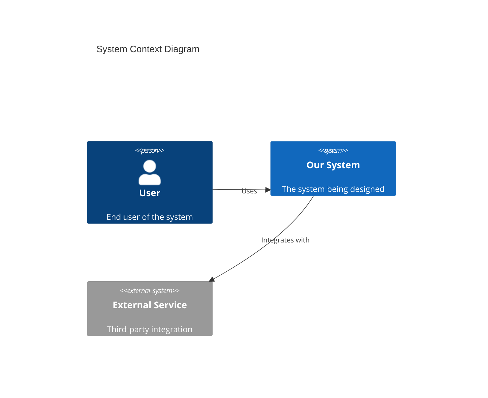
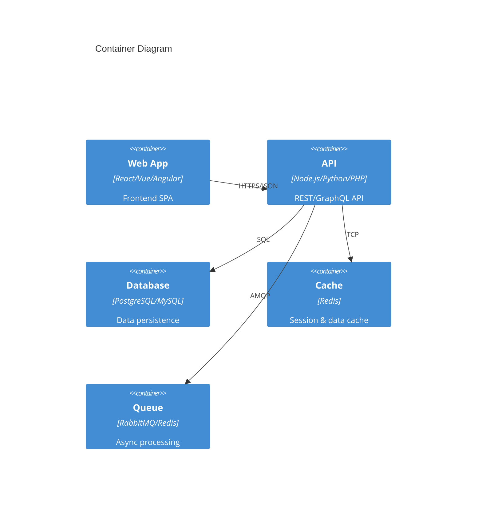
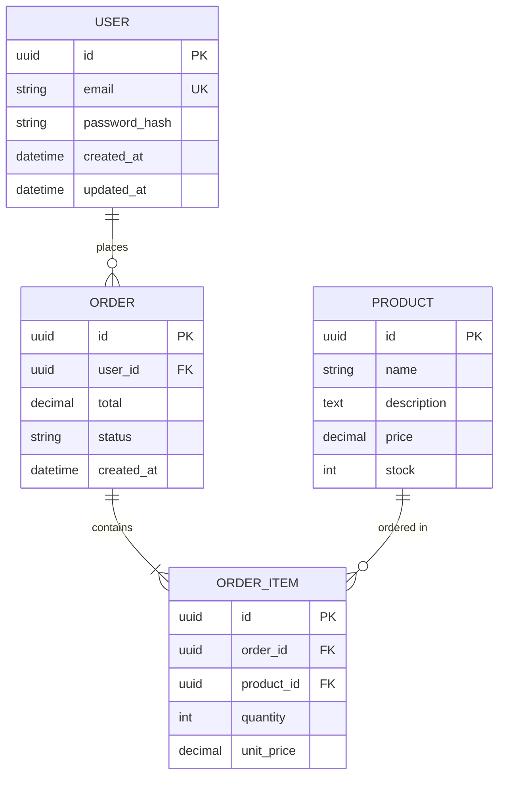
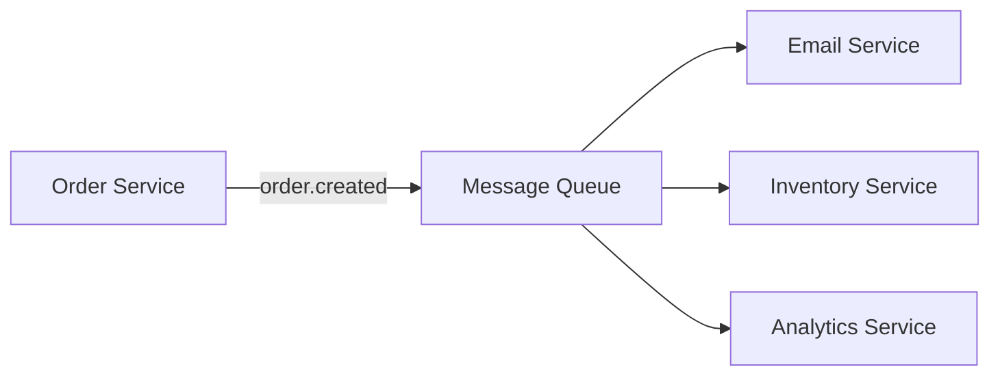
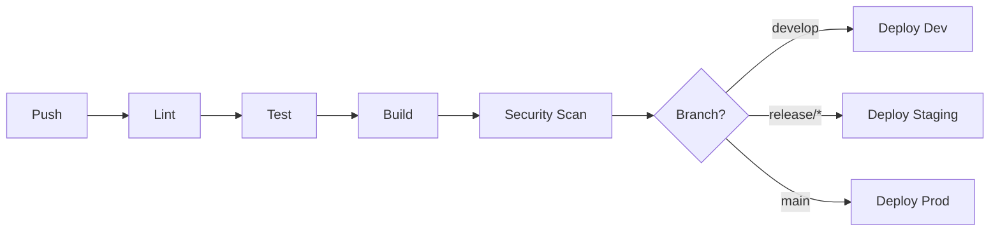

# Technical Specification

## Document Information

| Field | Value |
|-------|-------|
| **Project** | {project_name} |
| **Version** | {version} |
| **Date** | {date} |
| **Author** | {author} |
| **Related PRD** | [PRD Link](./prd.md) |
| **Status** | Draft / In Review / Approved |

---

## 1. Overview

### 1.1 Purpose
Technical implementation details for the requirements defined in the PRD.

### 1.2 Background
Brief technical context and existing system overview.

### 1.3 Goals
- Technical goal 1
- Technical goal 2

### 1.4 Non-Goals
- What this spec explicitly does NOT cover

---

## 2. Architecture Overview

### 2.1 System Context Diagram (C4 Level 1)



### 2.2 Container Diagram (C4 Level 2)



### 2.3 Technology Stack

| Layer | Technology | Version | Justification |
|-------|------------|---------|---------------|
| Frontend | {framework} | {version} | {reason} |
| Backend | {framework} | {version} | {reason} |
| Database | {database} | {version} | {reason} |
| Cache | {cache} | {version} | {reason} |
| Queue | {queue} | {version} | {reason} |
| Infrastructure | {cloud} | - | {reason} |

---

## 3. Data Model

### 3.1 Entity Relationship Diagram



### 3.2 Database Schema

#### Table: users
```sql
CREATE TABLE users (
    id UUID PRIMARY KEY DEFAULT gen_random_uuid(),
    email VARCHAR(255) UNIQUE NOT NULL,
    password_hash VARCHAR(255) NOT NULL,
    first_name VARCHAR(100),
    last_name VARCHAR(100),
    role VARCHAR(50) DEFAULT 'user',
    created_at TIMESTAMP DEFAULT CURRENT_TIMESTAMP,
    updated_at TIMESTAMP DEFAULT CURRENT_TIMESTAMP
);

CREATE INDEX idx_users_email ON users(email);
```

### 3.3 Data Migration Strategy

| Phase | Action | Rollback Plan |
|-------|--------|---------------|
| 1 | Add new columns | Drop columns |
| 2 | Migrate data | Restore from backup |
| 3 | Remove deprecated | Keep backup for 30 days |

---

## 4. API Design

### 4.1 REST Endpoints

#### Authentication
| Method | Endpoint | Description | Auth |
|--------|----------|-------------|------|
| POST | `/api/v1/auth/login` | User login | No |
| POST | `/api/v1/auth/register` | User registration | No |
| POST | `/api/v1/auth/refresh` | Refresh token | Yes |
| POST | `/api/v1/auth/logout` | User logout | Yes |

#### Resources
| Method | Endpoint | Description | Auth |
|--------|----------|-------------|------|
| GET | `/api/v1/users` | List users | Admin |
| GET | `/api/v1/users/{id}` | Get user | Yes |
| PUT | `/api/v1/users/{id}` | Update user | Owner |
| DELETE | `/api/v1/users/{id}` | Delete user | Admin |

### 4.2 Request/Response Examples

#### POST /api/v1/auth/login
```json
// Request
{
    "email": "user@example.com",
    "password": "securepassword"
}

// Response 200
{
    "access_token": "eyJhbGciOiJIUzI1NiIs...",
    "refresh_token": "eyJhbGciOiJIUzI1NiIs...",
    "expires_in": 3600,
    "token_type": "Bearer"
}

// Response 401
{
    "error": "invalid_credentials",
    "message": "Email or password is incorrect"
}
```

### 4.3 Error Codes
| Code | HTTP Status | Description |
|------|-------------|-------------|
| `invalid_credentials` | 401 | Wrong email/password |
| `token_expired` | 401 | Access token expired |
| `forbidden` | 403 | Insufficient permissions |
| `not_found` | 404 | Resource not found |
| `validation_error` | 422 | Invalid input data |

### 4.4 Rate Limiting
| Endpoint | Limit | Window |
|----------|-------|--------|
| `/api/v1/auth/*` | 10 | 1 minute |
| `/api/v1/*` | 100 | 1 minute |
| `/api/v1/export/*` | 5 | 1 hour |

---

## 5. Component Design

### 5.1 Backend Components

#### Service Layer Architecture
```
┌─────────────────────────────────────────────────────────┐
│                    Controllers                           │
│  (HTTP handling, validation, response formatting)        │
├─────────────────────────────────────────────────────────┤
│                    Services                              │
│  (Business logic, orchestration)                         │
├─────────────────────────────────────────────────────────┤
│                    Repositories                          │
│  (Data access, queries)                                  │
├─────────────────────────────────────────────────────────┤
│                    Models/Entities                       │
│  (Domain objects, validation rules)                      │
└─────────────────────────────────────────────────────────┘
```

#### Key Services
| Service | Responsibility | Dependencies |
|---------|----------------|--------------|
| `AuthService` | Authentication, tokens | UserRepository, JwtService |
| `UserService` | User CRUD, profiles | UserRepository, CacheService |
| `OrderService` | Order processing | OrderRepository, PaymentService |

### 5.2 Frontend Components

#### Component Hierarchy
```
App
├── Layout
│   ├── Header
│   ├── Sidebar
│   └── Footer
├── Pages
│   ├── HomePage
│   ├── DashboardPage
│   └── SettingsPage
└── Shared
    ├── Button
    ├── Input
    ├── Modal
    └── Table
```

#### State Management
| Store | State | Actions |
|-------|-------|---------|
| `authStore` | user, token, isAuthenticated | login, logout, refresh |
| `uiStore` | theme, sidebar, notifications | toggle, notify |

### 5.3 Infrastructure Components

```
┌─────────────────────────────────────────────────────────┐
│                      CDN (CloudFlare)                    │
├─────────────────────────────────────────────────────────┤
│                    Load Balancer (ALB)                   │
├──────────────────────┬──────────────────────────────────┤
│   Web Servers (×3)   │        API Servers (×3)          │
│   (Nginx + Static)   │        (Node.js/PHP/Python)      │
├──────────────────────┴──────────────────────────────────┤
│                    Database Cluster                      │
│                (Primary + Read Replicas)                 │
├─────────────────────────────────────────────────────────┤
│                    Redis Cluster                         │
│              (Session + Cache + Queue)                   │
└─────────────────────────────────────────────────────────┘
```

---

## 6. Integration Points

### 6.1 External Services

| Service | Purpose | Protocol | Auth Method |
|---------|---------|----------|-------------|
| Stripe | Payments | REST | API Key |
| SendGrid | Email | REST | API Key |
| AWS S3 | File storage | SDK | IAM Role |
| Twilio | SMS | REST | API Key |

### 6.2 Internal Services

| Service | Purpose | Protocol | Discovery |
|---------|---------|----------|-----------|
| Auth Service | Authentication | gRPC | Consul |
| Notification Service | Alerts | AMQP | Static |

### 6.3 Event-Driven Architecture



#### Events Published
| Event | Payload | Consumers |
|-------|---------|-----------|
| `user.created` | `{id, email, name}` | Email, Analytics |
| `order.created` | `{id, userId, items, total}` | Email, Inventory |
| `order.shipped` | `{id, trackingNumber}` | Email, Notification |

---

## 7. Security Considerations

### 7.1 Authentication
- **Method**: JWT with refresh tokens
- **Token Lifetime**: Access (15 min), Refresh (7 days)
- **Storage**: HttpOnly cookies (refresh), Memory (access)

### 7.2 Authorization
- **Model**: RBAC (Role-Based Access Control)
- **Roles**: Admin, Manager, User, Guest
- **Implementation**: Middleware + Policy classes

### 7.3 Data Protection
| Data Type | At Rest | In Transit |
|-----------|---------|------------|
| Passwords | Argon2id | N/A |
| PII | AES-256 | TLS 1.3 |
| Tokens | N/A | TLS 1.3 |
| Backups | AES-256 | TLS 1.3 |

### 7.4 OWASP Top 10 Mitigations
| Vulnerability | Mitigation |
|---------------|------------|
| Injection | Parameterized queries, ORM |
| Broken Auth | MFA, rate limiting, secure tokens |
| XSS | CSP headers, output encoding |
| CSRF | SameSite cookies, CSRF tokens |
| Security Misconfiguration | Automated security scanning |

---

## 8. Performance & Scalability

### 8.1 Performance Requirements
| Metric | Target | Measurement |
|--------|--------|-------------|
| TTFB | < 200ms | p95 |
| LCP | < 2.5s | p75 |
| API Response | < 100ms | p95 |
| DB Query | < 50ms | p95 |

### 8.2 Caching Strategy
| Layer | Technology | TTL | Invalidation |
|-------|------------|-----|--------------|
| Browser | HTTP Cache | 1h | ETag |
| CDN | CloudFlare | 24h | Purge API |
| Application | Redis | 5m | Event-based |
| Database | Query Cache | 1m | Auto |

### 8.3 Scaling Strategy
| Component | Strategy | Trigger |
|-----------|----------|---------|
| Web | Horizontal (Auto) | CPU > 70% |
| API | Horizontal (Auto) | CPU > 70% |
| Database | Read Replicas | Connections > 80% |
| Cache | Cluster Mode | Memory > 80% |

---

## 9. Testing Strategy

### 9.1 Unit Tests
- **Coverage Target**: 80%
- **Framework**: Jest / PHPUnit / pytest
- **Mocking**: Service dependencies

### 9.2 Integration Tests
- **Scope**: API endpoints, database operations
- **Framework**: Supertest / Cypress
- **Database**: Test containers

### 9.3 E2E Tests
- **Scope**: Critical user journeys
- **Framework**: Playwright / Cypress
- **Environments**: Staging

### 9.4 Performance Tests
- **Tool**: k6 / JMeter
- **Scenarios**: Load, Stress, Spike
- **Baseline**: 1000 concurrent users

### 9.5 Test Pyramid
```
        /\
       /  \      E2E (10%)
      /----\
     /      \    Integration (20%)
    /--------\
   /          \  Unit (70%)
  /------------\
```

---

## 10. Deployment

### 10.1 Environments
| Environment | Purpose | URL | Branch |
|-------------|---------|-----|--------|
| Development | Dev testing | dev.example.com | develop |
| Staging | QA testing | staging.example.com | release/* |
| Production | Live | example.com | main |

### 10.2 CI/CD Pipeline


### 10.3 Rollback Strategy
1. **Automatic**: Health check failures trigger rollback
2. **Manual**: `kubectl rollout undo` or feature flag
3. **Database**: Backward-compatible migrations only
4. **Recovery Time**: < 5 minutes

---

## 11. Monitoring & Observability

### 11.1 Logging
| Level | Use Case | Retention |
|-------|----------|-----------|
| ERROR | Exceptions, failures | 90 days |
| WARN | Degraded performance | 30 days |
| INFO | Business events | 14 days |
| DEBUG | Development only | 1 day |

### 11.2 Metrics
| Metric | Type | Alert Threshold |
|--------|------|-----------------|
| Request Rate | Counter | N/A |
| Error Rate | Gauge | > 1% |
| Response Time | Histogram | p99 > 1s |
| CPU Usage | Gauge | > 80% |
| Memory Usage | Gauge | > 85% |

### 11.3 Alerting
| Alert | Severity | Channel | Response Time |
|-------|----------|---------|---------------|
| Service Down | Critical | PagerDuty | 5 min |
| High Error Rate | High | Slack | 15 min |
| Performance Degradation | Medium | Email | 1 hour |

---

## 12. Technical Decisions (ADRs)

| ID | Decision | Options Considered | Chosen | Rationale |
|----|----------|-------------------|--------|-----------|
| ADR-001 | Database | PostgreSQL, MySQL, MongoDB | PostgreSQL | ACID compliance, JSON support |
| ADR-002 | Cache | Redis, Memcached | Redis | Persistence, data structures |
| ADR-003 | API Style | REST, GraphQL, gRPC | REST | Simplicity, caching, team expertise |

---

## 13. Dependencies & Risks

### 13.1 Technical Dependencies
| Dependency | Version | License | Risk |
|------------|---------|---------|------|
| {library} | {version} | MIT | Low |
| {framework} | {version} | Apache 2.0 | Low |

### 13.2 Technical Risks
| Risk | Probability | Impact | Mitigation |
|------|-------------|--------|------------|
| Third-party API downtime | Medium | High | Circuit breaker, fallback |
| Database scaling | Low | High | Sharding strategy ready |
| Security vulnerability | Medium | Critical | Regular audits, updates |

---

## 14. Appendix

### 14.1 Glossary
| Term | Definition |
|------|------------|
| JWT | JSON Web Token |
| RBAC | Role-Based Access Control |
| CDN | Content Delivery Network |

### 14.2 References
- [PRD Document](./prd.md)
- [API Documentation](./api-docs.md)
- [Architecture Decision Records](./adr/)

### 14.3 Revision History
| Version | Date | Author | Changes |
|---------|------|--------|---------|
| 0.1 | {date} | {author} | Initial draft |
| 1.0 | {date} | {author} | Approved version |
